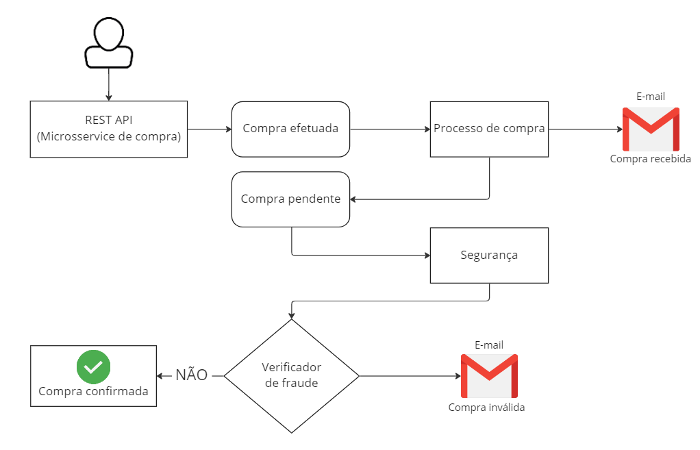

<h1 align="center">
        
Web-Service de compras

</h1>

Projeto webservice de compras usando API-REST e microsserviços utilizando spring-boot, mensageria com RabbitMQ                    e containeres Docker

<h1 align="center"></h1>

### 🛠️ Arquitetura utilizada

### ⚠️ Pré-requisitos

-

### 🎲 Rodando o projeto

-

### 🛠 Tecnologias e Ferramentas utilizadas

As seguintes ferramentas foram usadas na construção do projeto:

- [Java](https://www.java.com/pt-BR/)
- [Arquitetura JavaEE](https://www.oracle.com/br/java/technologies/java-ee-glance.html)
- [PostgreSQL](https://www.postgresql.org/)
- [Spring-boot](https://spring.io/projects/spring-boot)
- [Docker](https://www.docker.com/)
- [AWS](https://aws.amazon.com/pt/)
- [Amazon S3](https://aws.amazon.com/pt/s3/)
- [Git actions](https://docs.github.com/pt/actions)
- [AWS codepipeline](https://aws.amazon.com/pt/codepipeline/)
- [IDE - Intelij](https://www.jetbrains.com/pt-br/idea/download/#section=windows) 

